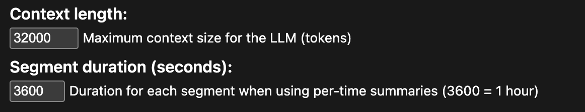

# ***This is vibe coded and should only be run locally. It will be writing .MD files to your actual Obsidian vault. A good idea to simply test out summarization and meta data generation outside your Obsidian vault first. Use with caution***

# YouTube & Podcast Transcript to Obsidian

A Flask web application that automatically generates structured Markdown notes from YouTube videos and podcast episodes, saving them directly to your Obsidian vault. Uses local Ollama for AI-powered summarization and faster-whisper for podcast transcription.

**Human Words:** I built this app to combine my love for Obsidian note taking with my consumption of video and audio media. At first, I just wanted a script that would set up a note for me with relevant metadata. From there, I wanted functionality for the script to add in a summary of the media as well. From there, I wanted a web app where I could drop in a URL and tweak settings to my heart's content. 

## Quick Start

### Prerequisites

1. **Docker & Docker Compose** installed on your system
2. **Ollama** running on your host machine with a model pulled (e.g., `ollama pull llama3.1:8b`)
3. **Obsidian vault** location on your filesystem

### Setup Steps

1. **Clone the repository**:
  

2. **Copy `.env.example` to `.env` and configure `.env` file**:
   
   Open the `.env` file, then update these critical values:
   
   ```bash
   # Change this to a random string
   FLASK_SECRET_KEY=your-secret-key-here
   
   # Update if your Ollama uses a different port or isn't on localhost
   OLLAMA_BASE_URL=http://host.docker.internal:11434
   
   # Change to your preferred model
   OLLAMA_MODEL=llama3.1:8b
   
   # Set default folder to save note to. Your actual vault path is set in docker-compose file 
   OBSIDIAN_FOLDER=youtube
   ```

3. **Configure `docker-compose.yml`**:
   
   **REQUIRED**: Update the Obsidian vault path in both `web` and `worker` services:
   
   ```yaml
   services:
     web:
       volumes:
         - type: bind
           source: "/absolute/path/to/your/vault"  # <- CHANGE THIS
           target: /vault
   
     worker:
       volumes:
         - type: bind
           source: "/absolute/path/to/your/vault"  # <- CHANGE THIS
           target: /vault
   ```
   
   Replace the `source` path with your actual Obsidian vault path.
   
   **Optional**: Adjust worker resource limits if processing long podcasts (4+ hours):
   
   ```yaml
   worker:
     deploy:
       resources:
         limits:
           memory: 32G  # Reduce to 16G for shorter content
           cpus: '8'    # Reduce to 4 for shorter content
   ```

4. **Start the application**:
   ```bash
   docker-compose up -d
   ```

5. **Verify Ollama is accessible**:
   ```bash
   # From your host machine
   curl http://localhost:11434/api/tags
   ```
   You should see a list of your pulled models.

6. **Access the web interface**:
   ```
   http://localhost:5050
   ```

7. **Test with a YouTube video**:
   - Paste a YouTube URL
   - Keep default settings
   - Click "Submit"
   - Follow the job status link to watch progress
   - Find your note in `{OBSIDIAN_VAULT}/{OBSIDIAN_FOLDER}/`

### Common Issues

- **Can't connect to Ollama**: Ensure `OLLAMA_BASE_URL` uses `http://host.docker.internal:11434` on macOS/Windows, or check `extra_hosts` configuration on Linux
- **Notes not appearing**: Verify the volume mount paths in `docker-compose.yml` match your Obsidian vault location
- **Podcast transcription fails**: Set `PODCAST_ASR_ENABLE=1` in `.env` and ensure adequate RAM (16GB+) is available

## Overview
**Disclaimer: This was mostly vibe coded - including the README** 


This application makes a few assumptions: 
* You are already self hosting an LLM and are somewhat familiar with interacting with it. 
* You are familiar with how Docker works and are used to modifying `.env` files and using `docker compose`

**Vibe Coded README**

This application provides a web interface to:

- **YouTube Videos**: Extract transcripts (via YouTube API or yt-dlp subtitles) and generate structured summaries with key points, timestamps, and quotes
- **Podcast Episodes**: Download audio from podcast URLs (Apple Podcasts, Spotify, RSS feeds, etc.), transcribe using faster-whisper ASR, and create detailed summaries
- **Ollama Integration**: Use local LLM models for intelligent summarization with customizable prompts
- **Obsidian Export**: Save notes with YAML frontmatter directly to your Obsidian vault
- **Background Processing**: Redis Queue (RQ) handles long-running transcription and summarization tasks
- **Customizable Prompts**: Configure system, summary, and segment prompts via web interface or environment variables
- **Advanced Options**: Cookie support for age-gated content, proxy support, rate limiting, and per-segment summaries for long content

### Key Features

- **Transcript Sources**: YouTube Transcript API, yt-dlp subtitles, or faster-whisper ASR for podcasts
- **Flexible Summarization**: Full transcript summaries or per-segment summaries for long content (1+ hour)
- **Rate Limiting**: Download rate limiting (1MB/s default) to prevent bandwidth issues
- **Progress Tracking**: Real-time job status updates with detailed logging
- **Cookie & Proxy Support**: Access age-gated or geo-restricted content
- **Docker Deployment**: Containerized with docker-compose for easy setup

## Environment Variables (.env)

The application is configured entirely through environment variables. Copy the `.env.example` file to `.env` and customize as needed. Most of these can be overridden in the web interface as well.

### Web Application

```bash
# Flask configuration
FLASK_SECRET_KEY=a-very-secret-key    # Change this to a random string
PORT=5050                              # Web interface port (default: 5050)
```

### Redis Queue Configuration

```bash
REDIS_URL=redis://redis:6379/0         # Redis connection URL
RQ_QUEUE=yt                            # Queue name for background jobs
RQ_JOB_TIMEOUT=3600                    # Job timeout in seconds (1 hour)
RQ_RESULT_TTL=86400                    # Keep successful results for 24 hours
RQ_FAILURE_TTL=604800                  # Keep failed results for 7 days
```

### Obsidian Vault Configuration

```bash
OBSIDIAN_VAULT=/vault                  # Mount point inside container (don't change)
OBSIDIAN_FOLDER=youtube                # Subfolder within vault for notes
YT_LANGS=en,en-US,en-GB                # Preferred transcript languages
```

**Important**: The container writes to `/vault` internally. Use docker-compose volume mapping to point this to your actual Obsidian vault path on the host.

### Ollama Configuration

```bash
OLLAMA_BASE_URL=http://host.docker.internal:11434  # Ollama server URL
OLLAMA_MODEL=gpt-oss:120b              # Model to use for summarization
OLLAMA_CONTEXT_LENGTH=32000            # Context window size (default: 32000)
```

**Note**: 
- On **macOS/Windows**: Use `http://host.docker.internal:11434` to access Ollama running on the host
- On **Linux**: The docker-compose file includes `extra_hosts` mapping to support `host.docker.internal`

### yt-dlp Configuration (Optional)

```bash
YTDLP_COOKIES=/vault/cookies.txt       # Netscape-format cookies file for age-gated content
YTDLP_PROXY_FILE=/vault/proxies.txt    # Text file with one proxy per line (format: http://host:port)
```

**Cookies**: Export browser cookies in Netscape format and place in your vault. Useful for age-restricted or member-only content. If you've used `yt-dlp` previously, this will be familiar.

**Proxies**: Create a text file with one proxy per line. The app will randomly select proxies for each request. Format: `http://proxy.example.com:8080`

### Podcast ASR Configuration

```bash
PODCAST_ASR_ENABLE=1                   # Enable ASR transcription (required for podcasts)
PODCAST_ASR_MODEL=tiny.en              # Whisper model: tiny, base, small, medium, large-v3
PODCAST_ASR_DEVICE=cpu                 # Device: cpu or cuda (requires GPU)
PODCAST_ASR_COMPUTE=int8               # Compute type: int8, float16, float32
PODCAST_ASR_BATCH_SIZE=1               # Batch size (1 for CPU, 8-24 for GPU)
PODCAST_ASR_BEAM_SIZE=3                # Beam search size (higher=more accurate but slower)
ASR_CHUNK_DURATION=3600                # Chunk duration in seconds (1 hour default)
```

**Model Selection**:
- `tiny`/`tiny.en`: Fastest, lowest accuracy, ~1GB RAM
- `base`/`base.en`: Good balance, ~1GB RAM
- `small`/`small.en`: Better accuracy, ~2GB RAM
- `medium`/`medium.en`: High accuracy, ~5GB RAM
- `large-v3`: Best accuracy, ~10GB RAM

**GPU Configuration Examples**:

```bash
# GPU with 8GB VRAM
PODCAST_ASR_DEVICE=cuda
PODCAST_ASR_COMPUTE=float16
PODCAST_ASR_BATCH_SIZE=16

# GPU with 16GB+ VRAM
PODCAST_ASR_DEVICE=cuda
PODCAST_ASR_COMPUTE=float16
PODCAST_ASR_BATCH_SIZE=24
```

### Ollama Prompts

All prompts support placeholders: `{title}`, `{url}`, `{transcript}`, `{show}`, `{start_hms}`, `{end_hms}`

```bash
# System prompt prepended to all summarization requests
OLLAMA_SYSTEM_PROMPT="You are a precise note-taker creating concise, accurate summaries for Obsidian..."

# YouTube full transcript summary
YOUTUBE_SUMMARY_PROMPT="You will summarize a YouTube transcript.\nTitle: {title}..."

# YouTube per-hour segment summary
YOUTUBE_SEGMENT_PROMPT="Summarize this portion of a YouTube stream/video..."

# Podcast full transcript summary
PODCAST_SUMMARY_PROMPT="You will summarize a podcast transcript.\nShow: {show}..."

# Podcast per-segment summary
PODCAST_SEGMENT_PROMPT="Summarize this portion of a podcast episode..."
```

**Customization**: These defaults can be overridden in the web interface on a per-request basis. The web form provides three text areas for system, summary, and segment prompts.

## Docker Compose Volume Mapping

The `docker-compose.yml` file uses volume mappings to connect the containerized application with your host system.


#### Bind Mounts (Host Directory Mapping)

**Obsidian Vault Mount** (`/vault`):
- **Purpose**: Maps your host Obsidian vault directory to `/vault` inside containers
- **Used by**: Both `web` and `worker` containers
- **Configuration**: Update `source` to match your Obsidian vault path
- **Example**: 
  ```yaml
  source: "/absolute/path/to/obsidian/vault"  # macOS
  source: "/absolute/path/to/obsidian/vault"           # Linux
  source: "C:/absolute/path/to/obsidian/vault"        # Windows
  ```
- **Why**: Allows the app to write Markdown notes directly to your vault and read cookie/proxy files

#### Named Volumes (Docker-Managed Storage)

**Model Cache** (`models-cache`):
- **Purpose**: Persists downloaded faster-whisper and Hugging Face model files
- **Mounted at**: `/root/.cache` in worker container
- **Why**: 
  - Prevents re-downloading multi-GB models on container restart
  - Speeds up subsequent podcast transcriptions
  - Survives container removal
- **Size**: Can grow to 10GB+ depending on Whisper model size

**Redis Data** (`redis-data`):
- **Purpose**: Persists Redis database (job queue state, results)
- **Mounted at**: `/data` in redis container
- **Why**: 
  - Preserves job history across container restarts
  - Maintains result cache (24 hours default)
  - Prevents data loss on container recreation

### Resource Limits (Worker Container)

```yaml
deploy:
  resources:
    limits:
      memory: 32G      # Maximum memory (for very long transcriptions 4+ hours)
      cpus: '8'        # Maximum CPU cores
    reservations:
      memory: 16G      # Guaranteed memory
      cpus: '4'        # Guaranteed cores
```

**Adjustment Guidelines**:
- **Podcast Length < 1 hour**: 8GB memory, 2 CPU cores sufficient
- **Podcast Length 1-2 hours**: 16GB memory, 4 CPU cores recommended
- **Podcast Length 2-4 hours**: 24GB memory, 6 CPU cores recommended
- **Podcast Length 4+ hours**: 32GB memory, 8 CPU cores for best performance

**GPU Usage**: **CUDA is not currently functioning for faster-whisper.**


## Requirements

- **Docker & Docker Compose**: Latest version
- **Ollama**: Running on host machine with desired model pulled
- **Disk Space**: 10GB+ for model cache (if using podcast transcription)
- **RAM**: 16GB+ recommended for podcast transcription (see resource limits above)

## License

MIT
